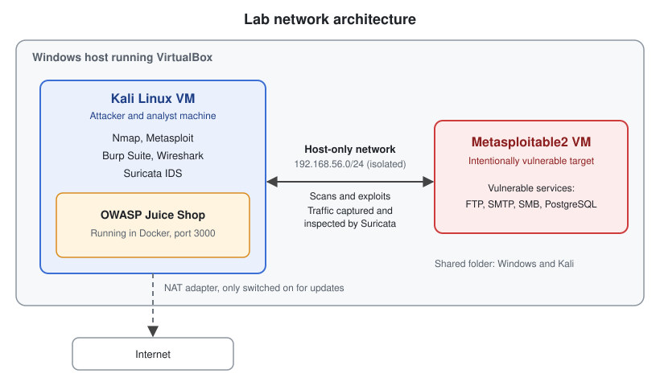

# Cybersecurity Portfolio

Hands-on cybersecurity lab projects covering both **offensive testing** and **defensive detection**, built in an isolated home lab using VirtualBox, Kali Linux, Metasploitable2, and OWASP Juice Shop.

I'm an aspiring cybersecurity professional building practical skills across vulnerability assessment, web application security, network analysis, and threat detection. Each project is documented with methodology, evidence, findings, and lessons learned.

> **Ethical note:** All testing was performed in a self-built, isolated lab against intentionally vulnerable systems. No real-world systems or networks were targeted.

---

## Skills Demonstrated

- **Vulnerability assessment:** network scanning, service enumeration, risk identification
- **Exploitation:** Metasploit, post-exploitation basics
- **Web application security:** OWASP Top 10 testing with Burp Suite (SQL injection, XSS, broken access control, broken authentication)
- **Network traffic analysis:** packet capture and inspection with Wireshark
- **Intrusion detection:** Suricata deployment, alert analysis, custom rule writing
- **Technical documentation:** structured write-ups with evidence and remediation notes

---

## Projects

| # | Project | What I did | Tools |
|---|---------|------------|-------|
| 01 | [Nmap Vulnerability Scan](./01-nmap-vulnerability-scan) | Scanned a target to identify open ports, services, and vulnerabilities | Nmap |
| 02 | [Metasploit Exploitation](./02-metasploit-exploitation) | Exploited Metasploitable2 to gain access to the target system | Metasploit |
| 03 | [Web Application Testing](./03-web-application-testing) | Found and documented SQL injection, XSS, IDOR, information disclosure, and authentication flaws in OWASP Juice Shop | Burp Suite, Docker |
| 04 | [Network Traffic Analysis](./04-network-traffic-analysis) | Captured and analysed network traffic to identify activity and protocols | Wireshark |
| 05 | [Suricata IDS Lab](./05-suricata-ids-lab) | Detected earlier attacks with Suricata, found a detection gap for the vsftpd backdoor exploit, and wrote a custom rule to close it | Suricata |

**The attack-then-detect thread:** Projects 1-3 simulate how an attacker finds and exploits weaknesses. Projects 4-5 look at the same activity from the defender's side, including a case where default detection rules missed an attack and I wrote a custom rule to catch it.

---

## Lab Environment

| Component | Role |
|-----------|------|
| VirtualBox | Virtualisation platform |
| Kali Linux | Attacker / analyst machine |
| Metasploitable2 | Intentionally vulnerable target |
| OWASP Juice Shop (Docker) | Intentionally vulnerable web application |
| Host-only network | Isolated lab network |

   

---

## Roadmap

- [ ] GRC project (risk assessment / policy documentation)
- [ ] AI-focused security project

---

## About Me

Actively seeking cybersecurity opportunities to help keep the digital space safe.

- LinkedIn: https://www.linkedin.com/in/joanne-kutto/
- Email: kuttojoanne@gmail.com
